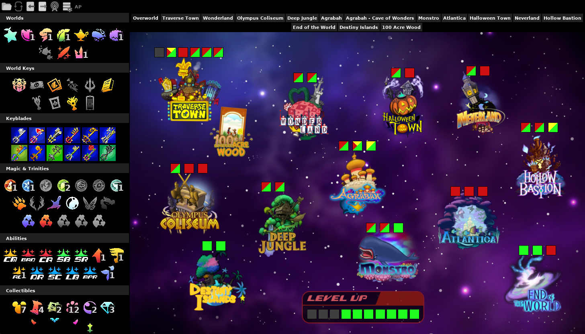
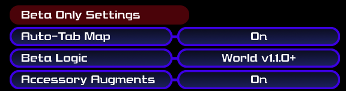

# Kingdom Hearts Final Mix AP Tracker

A [PopTracker](https://github.com/black-sliver/PopTracker/) Pack for Kingdom Hearts Final Mix to be used for the multiworld randomizer [Archipelago](https://archipelago.gg/).

## Getting Started

Download the most recent .zip file from the **Releases** and either drag it to the PopTracker window or place it in your `poptracker/packs` directory. For more details and instructions on how to connect the tracker to an Archipelago server see [PopTracker](https://github.com/black-sliver/PopTracker/).

## Features

- Supports advanced difficulty settings and color codes locations that require higher difficulty logic. Green locations are reachable on the current logic setting. Yellow are reachable out of logic with advanced tricks or difficult combat. Red are not reachable.
- Automatically reads player options from the AP server.
- Autotracking of found key items and checked locations.
- Highlighting of hinted item locations.

## Compatibility

| AP World Version | AP Version | PopTracker Pack Version |
|------------------|------------|-------------------------|
| v0.11.0+ (BETA)  | non-core   | v1.3.1+                 |
| v0.9.0+          | v0.6.4+    | v1.0.0+                 |

## Screenshot

## Pack Settings

All settings are loaded automatically when connecting the tracker to the AP server. Settings can also be changed manually to update which locations are displayed as available checks.

Settings are divided into five sections: settings, locations, goal, collectible requirements, and beta only logic.

### Settings

The Settings section controls when checks are considered available in logic or by a sequence break.

- **Logic Difficulty** controls what kinds of movement or skips are required to reach out of logic check locations. Checks that are only reachable with more advanced tricks than this setting's value are considered "out of logic". Out of logic checks will display as yellow on the map tracker. Logic difficulty options:
    - Beginner: Logic only expects what would be the natural solution in vanilla gameplay or similar, as well as a guarantee of tools for boss fights.
    - Normal: Logic expects some clever use of abilities, exploration of options, and competent combat ability; generally does not require advanced knowledge.
    - Proud: Logic expects advanced knowledge of tricks and obscure interactions, such as using Combo Master, Dumbo, and other unusual methods to reach locations.
    - Minimal: Logic expects the bare minimum to get to locations; may require extensive grinding, beating fights with no tools, and performing very difficult or tedious tricks.
- **Keyblade Locks** controls whether world-specific keyblades are needed to open chests in their respective world.
- **Stacking World Items** and **Halloween Town Key Item Bundled** control how worlds and key items unlock locations.
- **Accessory** controls whether new party members have checks for randomized starting accessories.

### Locations

The Locations section controls which optional world and minigame locations are enabled. Disabled options are not displayed on the map tracker.

### Goal

The Goal section controls the requirements for unlocking the **End of the World** and opening the **Final Rest Door**.

### Collectible Requirements

The Collectible Requirements section controls how many of a collectible are required for their respective goal. Note that a collectable is only required if their respective goal is set or if Destiny Islands checks are enabled.

### Beta Only Settings

These settings require the beta version of the AP world and KH1 randomizer mod (v0.11.0-v1.1.0, non-core).These settings are not available in the core version packaged with the AP launcher.

- **Auto-Tab Map** - Requires KH1 randomizer mod beta v1.1.0 or newer. You must also connect to the AP server using the in-game client that is only available in the beta version of the KH1 randomizer mod. Connecting with the KH1 text client from the AP launcher will not work. Enables or disables the map tab auto updating based on the players current world.
- **Beta Logic** - Changes the access logic for some locations to match the beta versions of the AP world. This value is automatically detected when connecting to the AP server and should only be manually changed if you are playing a beta version offline with manual tracking.
- **Accessory Augments** - Player option only available in the beta version of the AP world. This value is automatically detected when connecting to the AP server and should only be manually changed if you are playing a beta version offline with manual tracking.

## Feedback

Feedback is always appreciated. If there is an issue with the tracker, either open an issue here on github or contact me via Discord.

## Credits

- Original [Kingdom Hearts Final Mix AP Tracker](https://github.com/Lojtana/Kingdom-Hearts-FM-AP-Tracker) created by Lojtana.
- Icons were made by [Televo](https://github.com/Televo/kingdom-hearts-recollection) or taken from CoM rips by [GaryCXJk](https://www.spriters-resource.com/submitter/GaryCXJk/).